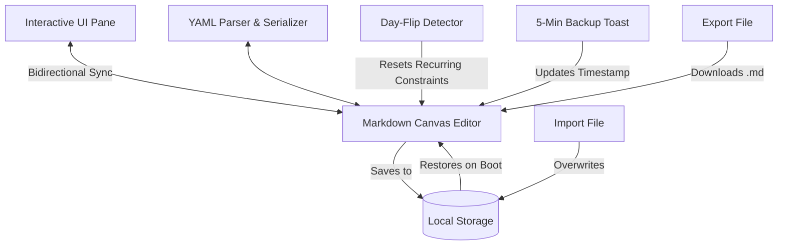

# Implementation Plan - To-Don't Habit Reform App

Create a single-page, local-first, offline-ready Progressive Web App (PWA) called **"To-Don't"** for tracking habits to avoid. The app features a dual-pane layout (interactive UI view and raw Markdown canvas editor) and enforces strict custom markdown rules with YAML front matter analytics.

## Proposed Changes

We will create the following files in the project root directory:
1. `index.html` — The main layout, split pane grid, header, and toast controls.
2. `style.css` — CSS variables, dual theme rules, custom checkbox assets, responsive columns, and transition effects.
3. `app.js` — The core logic, including YAML parsing, line-by-line custom Markdown parsing, bidirectional syncing, local storage handlers, day-flip calculations, and export timers.
4. `manifest.json` — PWA configuration registering the app, shortcuts, theme colors, and icons.
5. `sw.js` — Service worker using a cache-first strategy to cache static assets for full offline support.
6. `icon.svg` — Sleek, vector icon design representing a habit avoidance checkmark/cross.

---

### Component Design

### File Details

#### [NEW] [index.html](Documents/GitHub/[personal]/todonts/index.html)
- Main dual-pane layout wrapper.
- Left Pane: Interactive container with dynamically generated checkboxes, paragraphs, tables, and card structures.
- Right Pane: A robust `<textarea>` editing window with real-time feedback.
- Header controls: Title, profile username display, total success ticks counter, light/dark mode switch, file upload wrapper for **Import .md**, and a **Quick Export** download button.
- Bottom status bar containing cache version and last synchronized timestamp.

#### [NEW] [style.css](Documents/GitHub/[personal]/todonts/style.css)
- Implementation of custom typography (Outfit and JetBrains Mono from Google Fonts).
- CSS Variables mapping light and dark themes (off-white base vs dark gray base, with light green accent colors representing success stats).
- Visual Container `<
>` styles: Card blocks with `border-radius: 12px` and accent background.
- Custom checkboxes for:
  - Standard tasks (`- [ ]`)
  - Persistent habits (`- <[ ]>`) — showing strikethroughs but remaining interactive.
  - Recurring constraints (`- <<[ ]>>`) — turning gray and read-only upon checked.
- Bottom-center Toast animation container.

#### [NEW] [app.js](Documents/GitHub/[personal]/todonts/app.js)
- **YAML Engine**:
  - Custom JavaScript parsing and serializing of the YAML Front Matter blocks.
  - Profile metadata (`username`, `total_successes`, `global_last_synced`) and history stats (`id`, `streak`, `last_checked`).
- **Markdown & Custom Syntax Parser**:
  - Converts markdown headings, standard paragraphs, tables, lists, and links.
  - Custom rules:
    - `- [ ]` -> Standard tasks.
    - `- <[ ]>` -> Persistent habits.
    - `- <<[ ]>>` -> Recurring constraints.
    - `<
>` -> Card wrappers enclosing succeeding elements up to the next heading tag.
- **State Synchronizer**:
  - Live input typing event listener in the editor updates the interactive UI.
  - Checking a task matches the element's cached line index directly in the markdown lines array, updates the text (e.g. from `- <<[ ]>>` to `- <<[x]>>`), mutates YAML profile successes/history streaks, saves to localStorage, and updates both editor text (preserving selection range) and UI views.
- **Time/Day-Flip Manager**:
  - On load, compares current date with `global_last_synced` date.
  - If a calendar day has flipped, resets all `- <<[x]>>` items to `- <<[ ]>>` and marks stale streaks to `0`.
- **Export & Reminder Engine**:
  - 5-minute interval timer showing the bottom-center toast notification for 5 seconds.
  - Updates `global_last_synced` on interval trigger or file export.
  - Triggers `.md` download.

#### [NEW] [manifest.json](Documents/GitHub/[personal]/todonts/manifest.json)
- Fully qualified web app manifest referencing `icon.svg` and standard display controls.

#### [NEW] [sw.js](Documents/GitHub/[personal]/todonts/sw.js)
- Standard Service Worker caching the project assets. Handles cache eviction and self-registration.

#### [NEW] [icon.svg](Documents/GitHub/[personal]/todonts/icon.svg)
- A vector graphics asset containing a modern circular badge with a stylized cross/minus sign.

---

## Verification Plan

### Automated/Local Tests
We will spin up a local development server using Python's built-in HTTP server or a similar node script, and verify load state, console output, and functional behaviors.
1. Run local dev server: `python -m http.server 8000`
2. Test loading offline with Service Worker caching using DevTools Network throttling.
3. Validate YAML serializer correctness via console-based unit tests.

### Manual Verification
1. **Interactive Checkboxes**:
   - Checking standard (`- [ ]`) strikethroughs text and updates text to `- [x]`.
   - Checking persistent (`- <[ ]>`) strikethroughs and changes text to `- <[x]>` while remaining toggleable.
   - Checking recurring (`- <<[ ]>>`) turns it gray/disabled, increments `total_successes`, creates/updates streak history, and changes text to `- <<[x]>>`.
2. **Real-time Live Sync**:
   - Type text, tables, and card separators (`<
>`) in the Markdown editor and verify the left pane instantly matches styles.
   - Verify typing does not block the cursor or steal focus.
3. **Day-Flip Simulation**:
   - Manually change `global_last_synced` in the editor to yesterday's date, refresh the app, and verify that recurring tasks reset to unchecked and streaks update correctly.
4. **Toast Notification**:
   - Change the interval to 10 seconds for testing to confirm the bottom-center toast appears for exactly 5 seconds and updates the timestamp inside the front matter.
5. **Import/Export**:
   - Export a `.md` file, edit its content, upload it back, and verify the UI updates correctly.
